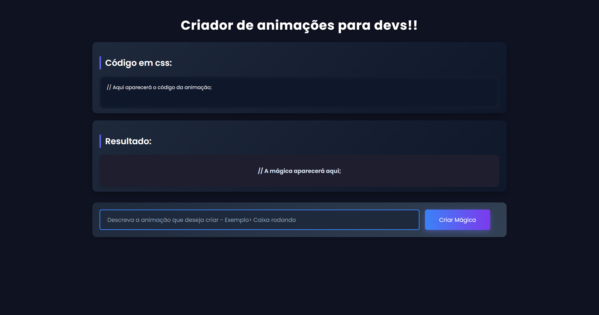

# ✨ Animation Generator with AI — HTML, CSS & JS

This project is a dynamic and responsive animation generator designed for developers. Built entirely with **HTML5**, **CSS3** and **JavaScript**, it features a clean UI that takes natural language descriptions and returns real-time **CSS animations** using an **AI-integrated webhook** via [n8n](https://n8n.io/).

---

## 🖼️ Website Preview



---

## 📚 Features

- 🎯 **Prompt-based animation generator** – describe what you want, get instant CSS
- ⚙️ **Webhook integration** via **n8n** – connects frontend to AI backend  
- 🧠 **AI response parsing** – injects live CSS and HTML directly into the DOM  
- 🎨 **Modern UI** – responsive design with shadows, gradients, and transitions  
- 🧪 **Real-time preview area** – see the animation magic immediately  
- 💬 **Clean code display** – generated CSS code is shown clearly in a styled block  

---

## 🧠 Technologies Used

- HTML5  
- CSS3 (custom transitions, gradients, media queries)  
- JavaScript (DOM manipulation, async/await, fetch API)  
- Google Fonts (`Poppins`)  
- [n8n](https://n8n.io/) — low-code automation to handle the AI webhook  
- Responsive layout using `flexbox`  

---

## 📁 File Structure

| File/Folder       | Description                                  |
|-------------------|----------------------------------------------|
| `index.html`      | Main page with structured semantic layout    |
| `styles.css`      | Full UI styling: layout, buttons, inputs     |
| `scripts.js`      | JavaScript logic to send/receive webhook data|
| `img/preview.png` | (Optional) Preview screenshot for GitHub     |

---

## ⚙️ How it Works

1. User describes an animation (ex: “caixa girando”)  
2. JS sends the input to an `n8n` webhook via `POST`  
3. Webhook triggers AI (via OpenAI or outro modelo)  
4. Response returns:  
   - `code`: CSS code  
   - `style`: dynamic style  
   - `preview`: HTML preview  
5. Page injects the response and renders everything ao vivo ✨  

---

## 🌐 Live Demo  

👉 Access the site here: https://akdomingues.github.io/AI-Animations

---

## 🚀 How to Run

1. Clone the repository
2. Open `index.html` in your browser

```bash
git clone https://github.com/your-user/animation-ai-generator.git
cd animation-ai-generator
start index.html
```

---

## 👨‍💻 Autor
**Domingues**

[GitHub](https://github.com/akdomingues) · [LinkedIn](www.linkedin.com/in/dominguescaua) · [Instagram](https://www.instagram.com/exe.domingues/)  
